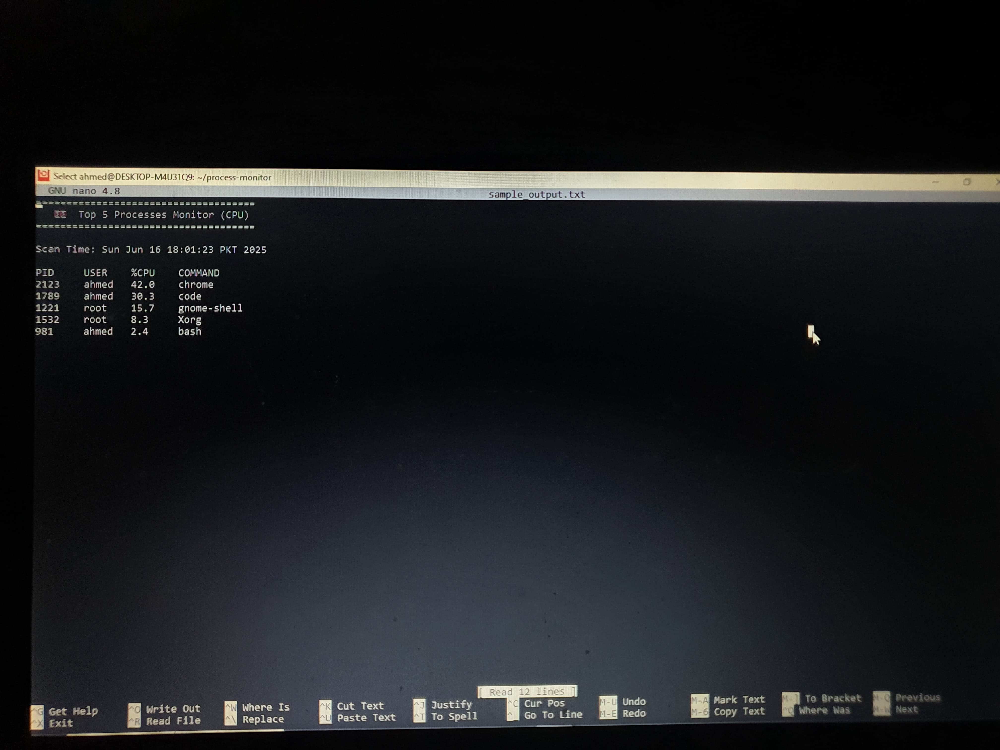
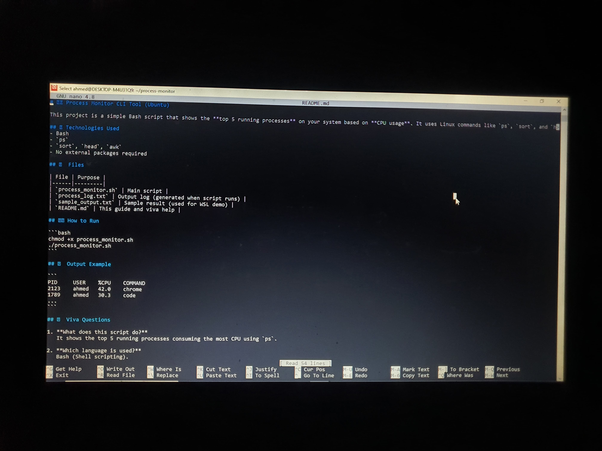
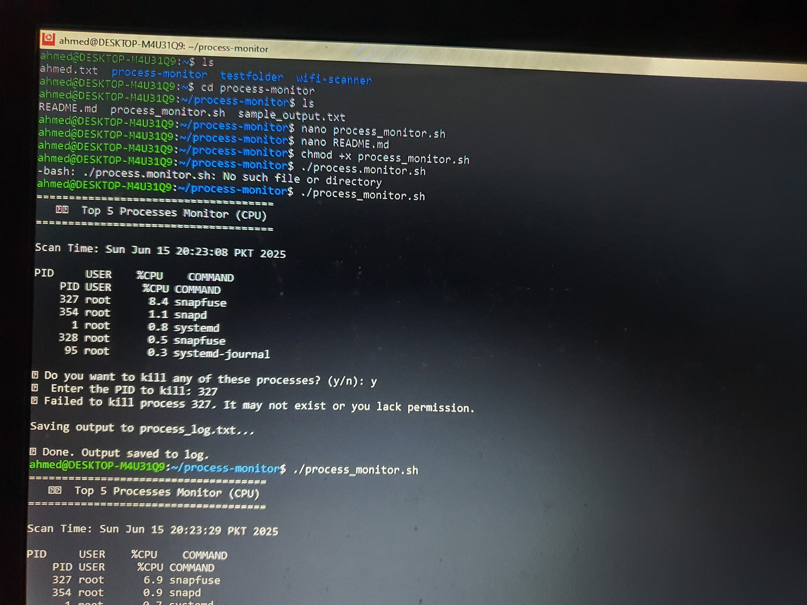

# 🖥️ Process Monitor CLI Tool (Ubuntu)

This project is a simple Bash script that shows the **top 5 running processes** on your system based on **CPU usage**. It uses Linux commands like `ps`, `sort`, and `head`.

## 🛠 Technologies Used
- Bash
- `ps`
- `sort`, `head`, `awk`
- No external packages required

## 📦 Files

| File | Purpose |
|------|---------|
| `process_monitor.sh` | Main script |
| `process_log.txt` | Output log (generated when script runs) |
| `sample_output.txt` | Sample result (used for WSL demo) |
| `README.md` | This guide and viva help |

## ▶️ How to Run

```bash
chmod +x process_monitor.sh
./process_monitor.sh
```

## 📂 Output Example

```
PID     USER    %CPU    COMMAND
2123    ahmed   42.0    chrome
1789    ahmed   30.3    code
...
```






## 📚 Viva Questions

1. **What does this script do?**  
   It shows the top 5 running processes consuming the most CPU using `ps`.

2. **Which language is used?**  
   Bash (Shell scripting).

3. **What is the command used to fetch processes?**  
   `ps -eo pid,user,%cpu,comm --sort=-%cpu`

4. **What is `ps`?**  
   It stands for “process status” and is used to show currently running processes.

5. **Why use `head -n 6`?**  
   First line is header, then top 5 processes = 6 lines total.

6. **How is this an OS-level project?**  
   It interacts with process management, which is a core part of operating systems.
